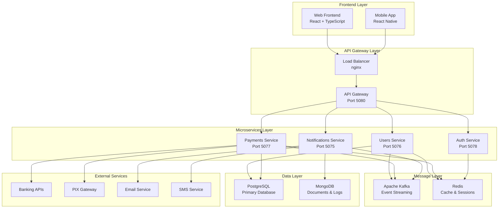

# 🏗️ PaymentGateway - Arquitetura Enterprise

## 📋 Índice
- [Visão Geral](#-visão-geral)
- [Arquitetura de Alto Nível](#-arquitetura-de-alto-nível)
- [Microserviços](#-microserviços)
- [Padrões Arquiteturais](#-padrões-arquiteturais)
- [Segurança](#-segurança)
- [Monitoramento](#-monitoramento)
- [Escalabilidade](#-escalabilidade)
- [Qualidade](#-qualidade)

## 🎯 Visão Geral

O PaymentGateway é uma solução enterprise de processamento de pagamentos construída com arquitetura de microserviços, seguindo as melhores práticas de Domain-Driven Design (DDD), CQRS, e Event-Driven Architecture.

### 🎨 Características Principais
- **Microserviços**: Arquitetura distribuída e escalável
- **Event-Driven**: Comunicação assíncrona via Apache Kafka
- **API-First**: Design centrado em APIs RESTful e gRPC
- **Cloud-Native**: Containerização com Docker e Kubernetes
- **Security-First**: Implementação robusta de segurança
- **Observability**: Monitoramento e logging completos

## 🏗️ Arquitetura de Alto Nível



## 🔧 Microserviços

### 👤 Users Service (Port 5076)
**Responsabilidade**: Gerenciamento de usuários e perfis bancários

#### 📊 Domínio
```csharp
public class BankUser
{
    public Guid Id { get; set; }
    public string Name { get; set; }
    public string Email { get; set; }
    public string CPF { get; set; }
    public string Agencia { get; set; }
    public string Conta { get; set; }
    public string AccountNumber { get; set; }
    public decimal CreditLimit { get; set; }
    public decimal AvailableBalance { get; set; }
    public bool TwoFactorEnabled { get; set; }
    public UserStatus Status { get; set; }
}
```

#### 🎯 Funcionalidades
- Cadastro e autenticação de usuários
- Gerenciamento de perfis bancários
- Validação de documentos (CPF/CNPJ)
- Controle de limites e saldos
- Auditoria de atividades

#### 🔄 Eventos Publicados
- `UserRegistered`
- `UserProfileUpdated`
- `UserStatusChanged`
- `CreditLimitUpdated`

### 💳 Payments Service (Port 5077)
**Responsabilidade**: Processamento de pagamentos e transações

#### 📊 Domínio
```csharp
public class Payment
{
    public Guid Id { get; set; }
    public Guid UserId { get; set; }
    public decimal Amount { get; set; }
    public string Currency { get; set; }
    public PaymentMethod Method { get; set; }
    public PaymentStatus Status { get; set; }
    public string Description { get; set; }
    public DateTime CreatedAt { get; set; }
    public DateTime? ProcessedAt { get; set; }
}
```

#### 🎯 Funcionalidades
- Processamento de pagamentos PIX
- Integração com bancos via gRPC
- Validação e antifraude
- Estornos e cancelamentos
- Reconciliação financeira

#### 🔄 Eventos Publicados
- `PaymentCreated`
- `PaymentProcessed`
- `PaymentFailed`
- `PaymentRefunded`

### 🔔 Notifications Service (Port 5075)
**Responsabilidade**: Gerenciamento de notificações multicanal

#### 📊 Domínio
```csharp
public class Notification
{
    public Guid Id { get; set; }
    public Guid UserId { get; set; }
    public NotificationType Type { get; set; }
    public string Channel { get; set; }
    public string Subject { get; set; }
    public string Content { get; set; }
    public NotificationStatus Status { get; set; }
    public DateTime CreatedAt { get; set; }
}
```

#### 🎯 Funcionalidades
- Notificações em tempo real (SignalR)
- Envio de emails transacionais
- SMS para confirmações críticas
- Push notifications mobile
- Templates personalizáveis

#### 🔄 Eventos Consumidos
- `PaymentProcessed`
- `UserRegistered`
- `FraudDetected`

## 🎨 Padrões Arquiteturais

### 🏛️ Domain-Driven Design (DDD)
```
📁 PaymentGateway/
├── 📁 Domain/
│   ├── 📁 Entities/
│   ├── 📁 ValueObjects/
│   ├── 📁 DomainServices/
│   ├── 📁 Repositories/
│   └── 📁 Events/
├── 📁 Application/
│   ├── 📁 Commands/
│   ├── 📁 Queries/
│   ├── 📁 Handlers/
│   └── 📁 DTOs/
├── 📁 Infrastructure/
│   ├── 📁 Data/
│   ├── 📁 External/
│   ├── 📁 Messaging/
│   └── 📁 Cache/
└── 📁 Presentation/
    ├── 📁 Controllers/
    ├── 📁 Middleware/
    └── 📁 ViewModels/
```

### ⚡ CQRS (Command Query Responsibility Segregation)
```csharp
// Commands
public class CreatePaymentCommand : IRequest<PaymentResult>
{
    public decimal Amount { get; set; }
    public string Currency { get; set; }
    public Guid UserId { get; set; }
}

// Queries
public class GetPaymentQuery : IRequest<PaymentDto>
{
    public Guid PaymentId { get; set; }
}

// Handlers
public class CreatePaymentHandler : IRequestHandler<CreatePaymentCommand, PaymentResult>
{
    // Implementation
}
```

### 🔄 Event Sourcing
```csharp
public class PaymentAggregate : AggregateRoot
{
    public void CreatePayment(decimal amount, string currency)
    {
        AddDomainEvent(new PaymentCreatedEvent(Id, amount, currency));
    }

    public void ProcessPayment()
    {
        AddDomainEvent(new PaymentProcessedEvent(Id, DateTime.UtcNow));
    }
}
```

## 🔒 Segurança

### 🔐 Autenticação e Autorização
```csharp
[Authorize(Policy = "PaymentProcessor")]
[RateLimit(Requests = 100, Window = "1m")]
public class PaymentsController : ControllerBase
{
    [HttpPost]
    [ValidateAntiForgeryToken]
    public async Task<IActionResult> CreatePayment([FromBody] CreatePaymentRequest request)
    {
        // Implementation with security validation
    }
}
```

### 🛡️ Camadas de Segurança
1. **API Gateway**: Rate limiting, IP whitelist, CORS
2. **JWT Tokens**: Stateless authentication
3. **RBAC**: Role-based access control
4. **Data Encryption**: AES-256 for sensitive data
5. **TLS/SSL**: End-to-end encryption
6. **Input Validation**: Comprehensive validation
7. **Audit Logging**: Complete activity tracking

### 🔍 Antifraude
```csharp
public class FraudDetectionService
{
    public async Task<FraudAnalysisResult> AnalyzePayment(Payment payment)
    {
        var riskScore = await CalculateRiskScore(payment);
        
        if (riskScore > 0.8)
        {
            await PublishEvent(new FraudDetectedEvent(payment.Id));
            return FraudAnalysisResult.Blocked;
        }
        
        return FraudAnalysisResult.Approved;
    }
}
```

## 📊 Monitoramento

### 📈 Observabilidade Stack
- **Metrics**: Prometheus + Grafana
- **Logging**: ELK Stack (Elasticsearch, Logstash, Kibana)
- **Tracing**: Jaeger distributed tracing
- **APM**: Application Performance Monitoring

### 🚨 Alertas e SLAs
```yaml
alerts:
  - name: HighErrorRate
    condition: error_rate > 1%
    duration: 5m
    
  - name: SlowResponse
    condition: response_time_p95 > 2s
    duration: 2m
    
  - name: HighCPU
    condition: cpu_usage > 80%
    duration: 10m

sla_targets:
  availability: 99.9%
  response_time_p95: 2s
  error_rate: < 0.1%
```

### 📊 Business Metrics
- Payment success rate
- Average transaction value
- User conversion funnel
- Revenue per user (RPU)
- Customer acquisition cost (CAC)

## ⚡ Escalabilidade

### 🔄 Horizontal Scaling
```yaml
# Kubernetes HPA
apiVersion: autoscaling/v2
kind: HorizontalPodAutoscaler
metadata:
  name: payments-hpa
spec:
  scaleTargetRef:
    apiVersion: apps/v1
    kind: Deployment
    name: payments-service
  minReplicas: 3
  maxReplicas: 100
  metrics:
  - type: Resource
    resource:
      name: cpu
      target:
        type: Utilization
        averageUtilization: 70
```

### 💾 Database Scaling
- **Read Replicas**: PostgreSQL read replicas
- **Sharding**: Horizontal partitioning by user ID
- **Connection Pooling**: PgBouncer for connection management
- **Caching**: Redis for frequently accessed data

### 🌍 Geographic Distribution
- **Multi-Region**: AWS/Azure multiple regions
- **CDN**: CloudFront for static assets
- **Edge Computing**: Lambda@Edge for latency reduction
- **Data Replication**: Cross-region database replication

## 📋 Qualidade

### 🧪 Testing Strategy
```
📊 Test Pyramid:
├── Unit Tests (70%)
│   ├── Domain Logic
│   ├── Business Rules
│   └── Utilities
├── Integration Tests (20%)
│   ├── API Endpoints
│   ├── Database Operations
│   └── External Services
└── E2E Tests (10%)
    ├── User Journeys
    ├── Payment Flows
    └── Critical Paths
```

### 📊 Quality Metrics
- **Code Coverage**: > 90%
- **Cyclomatic Complexity**: < 10
- **Maintainability Index**: > 80
- **Technical Debt Ratio**: < 5%
- **Duplication**: < 3%

### 🔍 Static Analysis
```yaml
# SonarQube Quality Gate
quality_gate:
  coverage: > 90%
  duplicated_lines_density: < 3%
  maintainability_rating: A
  reliability_rating: A
  security_rating: A
  security_hotspots_reviewed: 100%
```

### 📈 Performance Targets
- **Response Time P95**: < 2 seconds
- **Throughput**: > 1000 RPS
- **Error Rate**: < 0.1%
- **Availability**: 99.9%
- **MTTR**: < 15 minutes

## 🔧 DevOps & CI/CD

### 🚀 Deployment Pipeline
```yaml
stages:
  1. 🔍 Code Analysis (SonarQube, CodeQL)
  2. 🧪 Testing (Unit, Integration, E2E)
  3. 🔒 Security Scan (OWASP, Snyk)
  4. 🏗️ Build & Package (Docker)
  5. 🚀 Deploy to Staging
  6. 📊 Performance Tests
  7. 🏭 Deploy to Production
  8. 📈 Monitor & Alert
```

### 🐳 Containerization
```dockerfile
# Multi-stage build for optimization
FROM mcr.microsoft.com/dotnet/sdk:9.0 AS build
WORKDIR /src
COPY . .
RUN dotnet restore && dotnet build -c Release

FROM mcr.microsoft.com/dotnet/aspnet:9.0 AS runtime
WORKDIR /app
COPY --from=build /src/bin/Release/net9.0/ .
EXPOSE 80
ENTRYPOINT ["dotnet", "PaymentGateway.dll"]
```

## 📚 Documentação

### 📖 Tipos de Documentação
- **API Documentation**: OpenAPI/Swagger
- **Architecture Decision Records (ADRs)**
- **Runbooks**: Operational procedures
- **User Guides**: End-user documentation
- **Developer Guides**: Technical documentation

### 🔄 Versionamento
- **Semantic Versioning**: MAJOR.MINOR.PATCH
- **API Versioning**: Header-based versioning
- **Database Migrations**: Entity Framework migrations
- **Backward Compatibility**: Support for N-1 versions

---

## 🎯 Roadmap

### 📅 Q1 2024
- [ ] GraphQL API implementation
- [ ] Advanced fraud detection with ML
- [ ] Multi-currency support enhancement

### 📅 Q2 2024
- [ ] Blockchain integration (experimental)
- [ ] Advanced analytics dashboard
- [ ] Mobile SDK for third-party integration

### 📅 Q3 2024
- [ ] AI-powered customer support
- [ ] Advanced reporting and insights
- [ ] Compliance automation tools

---

**Documentação mantida por**: Time de Arquitetura PaymentGateway  
**Última atualização**: Janeiro 2024  
**Versão**: 2.0.0
